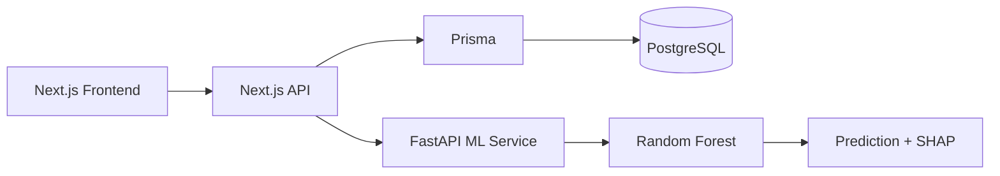

# Student Performance Analytics Platform

### Predictive Analytics for Student Performance Tracking

> An AI-powered EdTech platform that predicts student academic risk early
> and explains _why_ using SHAP so teachers can act, not just observe.


## Demo Accounts (seed data)

| Role    | Email            | Password |
| ------- | ---------------- | -------- |
| Admin   | admin@demo.com   | demo123  |
| Teacher | teacher@demo.com | demo123  |
| Student | student@demo.com | demo123  |

## Architecture



## Key Features (planned)

- 3 ML models: grade prediction, pass/fail risk, dropout risk
- SHAP explainability: per-student, feature-level risk explanation
- Role-based dashboards: Admin, Teacher, Student
- Vacation/Break Planner: burnout detection from performance data
- Real-time notifications for at-risk students

## Tech Stack

- Frontend: Next.js 14, TypeScript, Tailwind CSS, ShadCN UI, Recharts
- Backend: Next.js API Routes, Prisma v5, PostgreSQL (Neon)
- ML: Python, scikit-learn, XGBoost, SHAP, FastAPI
- Auth: NextAuth.js (RBAC — 3 roles)
- Cache: Redis (Upstash)
- Deploy: Vercel + Railway

## Local Setup

```bash
git clone https://github.com/aakashmane15/student-performance-platform.git
cd student-performance-platform/web

cp .env.example .env.local
# Fill in your Neon credentials

npx prisma migrate dev
npx prisma db seed
npm run dev
```

## In a separate terminal

```bash
cd ml_service

pip install -r requirements.txt
python train_basic.py
uvicorn main:app --reload
```
